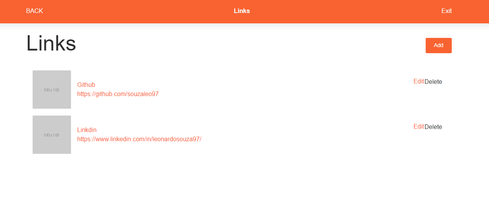

# Maratona JS - Gerenciador de links

    

# Sobre

Este projeto foi desenvolvido durante a Maratona JS ministrada pelo grande [Emerson Broga](https://emersonbroga.com/e/sobre/). O projeto consiste em um gerenciador de links, onde após o usuário se cadastrar ele pode salvar os links que lhe são importantes.

# Tecnologias

## Backend

O backend da aplicação foi contruído utilizando [NodeJs](https://nodejs.org/en/) juntamente com [Express](https://expressjs.com/pt-br/).

Para o gerenciamento e versionamento do banco de dados foi utilizada a biblioteca [Sequelize](https://sequelize.org/). E para a autenticação do sistema foi implementado a verificação através de tokens JWT.

## Frontend

Para a implementação do frontend foi utilizado [ReactJs](https://pt-br.reactjs.org/). Dentre algumas da funcionalidades implementadas, estão:

- Redux
- Autenticação JWT
- Refresh Token

Foi feita a integração com [Bootstrap](https://getbootstrap.com/) e com [SASS](https://sass-lang.com/)
